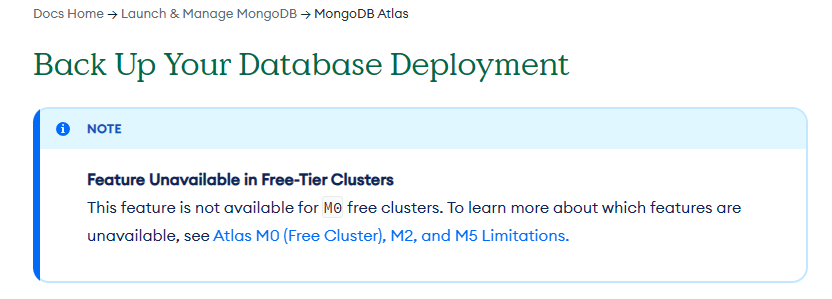

# Parcial II

## Parte 1

  Creación de Base de Datos y Documentos

### Pregunta 1 (5 puntos)

   Crea una nueva base de datos llamada "PeliculasSeries" en tu cluster de MongoDB Atlas. Utiliza Mongo Compass para verificar la creación exitosa de la base de datos.

### Pregunta 2 (10 puntos)

  Dentro de la base de datos "PeliculasSeries", crea una colección llamada "Peliculas" y otra llamada "Series". Inserta 5 documentos en cada colección con información relevante sobre películas y series.

  **Estructura:**

```JSON
{
  "titulo": "Blade Runner 2049",
  "director": {
    "nombre": "Denis Villeneuve",
    "nacionalidad": "Canadiense"
  },
  "anio": 2017,
  "genero": ["Ciencia ficción", "Thriller"],
  "calificacion": 8.5,
  "actores": [
    {
      "nombre": "Ryan Gosling",
      "personaje": "Oficial K"
    },
    {
      "nombre": "Harrison Ford",
      "personaje": "Rick Deckard"
    },
    {
      "nombre": "Ana de Armas",
      "personaje": "Joi"
    }
  ],
  "sinopsis": "En un futuro distópico, un blade runner descubre un secreto que podría sumir a la sociedad en el caos."
}

```

## Parte 2

  Consultas y Actualizaciones (Se debe utilizar el comando (función) de Mongo)

### Pregunta 3 (10 puntos)

  Escribe una consulta que muestre todas las películas en la colección "Peliculas" que tengan una calificación mayor a 8.0.

  ```SHELL
  use PeliculasSeries
  db.Peliculas.find({"calificacion": { $gt: 8}})

  ```

### Pregunta 4 (10 puntos)

  Actualiza uno de los documentos en la colección "Series", cambiando el año de lanzamiento a un año más reciente.

  ```SHELL
  use PeliculasSeries
  db.Series.updateOne({ "titulo": "Stranger Things" }, { $set: { anio: 2020 } });

  ```

## Parte 3

  Operaciones Avanzadas (Se debe utilizar el comando (función) de Mongo)

### Pregunta 5 (15 puntos)

  Agrega un nuevo campo llamado "Actores" a tres de los documentos en la colección "Peliculas". Este campo debe ser un array que contenga los nombres de al menos dos actores principales en cada película.
  
  Agrega actores al documento de The Matrix:
  
  ```SHELL
  use PeliculasSeries

  db.Peliculas.findAndModify({
    query: { "titulo": "The Matrix" },
    update: {
      $set: {
        Actores: db.Peliculas.find({ "titulo": "The Matrix" }, ["actores.nombre"])
          .toArray()[0]
          .actores.map((item) => item.nombre)
      }
    }
  }) 
  ```

  Agrega actores al documento de The Dark Knight:
  
  ```SHELL
  use PeliculasSeries
  
  db.Peliculas.findAndModify({
    query: { "titulo": "The Dark Knight" },
    update: {
      $set: {
        Actores: db.Peliculas.find({ "titulo": "The Dark Knight" }, ["actores.nombre"])
          .toArray()[0]
          .actores.map((item) => item.nombre)
      }
    }
  })
  ```

  Agrega actores al documento de Pulp Fiction:
  
  ```SHELL
  use PeliculasSeries
  
  db.Peliculas.findAndModify({
    query: { "titulo": "Pulp Fiction" },
    update: {
      $set: {
        Actores: db.Peliculas.find({ "titulo": "Pulp Fiction" }, ["actores.nombre"])
          .toArray()[0]
          .actores.map((item) => item.nombre)
      }
    }
  })
  ```

### Pregunta 6 (15 puntos)

  Realiza una consulta que muestre todas las series en las que participa un actor específico que elijas. Utiliza el operador adecuado para realizar esta consulta.

  Consulta de las series en las que participa Millie Bobby Brown:
  
  ```SHELL
  use PeliculasSeries
  db.Series.find({ $and: [{ "actores.nombre": "Millie Bobby Brown" }] });
  
  ```

## Parte 4

  Eliminación de Documentos

### Pregunta 7 (10 puntos)

  Elimina dos documentos de la colección "Peliculas" que tengan una calificación menor a 7.0.

  ```SHELL
  use PeliculasSeries
  db.Peliculas.deleteMany({
    $and: [
      {
        _id: {
          $in: db.Peliculas.find({ $and: [ { calificacion: { $lt: 7.0 } } ] }, ["_id"])
          .limit(2)
          .toArray()
          .map((item) => item._id)
        
        }
      }
    ]
  });
  ```

### Pregunta 8 (10 puntos)

  Elimina una serie de la colección "Series" basándote en algún criterio que elijas.

  Se elimina la serie con el titulo "Breaking Bad":

```SHELL
  use PeliculasSeries
  db.Series.deleteOne({ 
    $and: [ { titulo : "Breaking Bad" } ]
  });
```

## Parte 5

  Respaldo y Restauración

### Pregunta 9 (10 puntos)

  Realiza un respaldo de la base de datos "PeliculasSeries" en MongoDB Atlas.
  Describe los pasos que seguirías para restaurar esta base de datos en caso de pérdida de datos.

  1. Seleccionar la base de datos a restaurar.
  2. Seleccionar la opción "Restore".
  3. Seleccionar el punto de restauración deseado.
  4. Seleccionar la opción "Restore".
  5. Esperar a que se restaure la base de datos.
  6. Verificar que la base de datos se haya restaurado correctamente.
  7. Listo.

Nota: En las bases de datos gratis no se puede realizar respaldo ni restauración.

